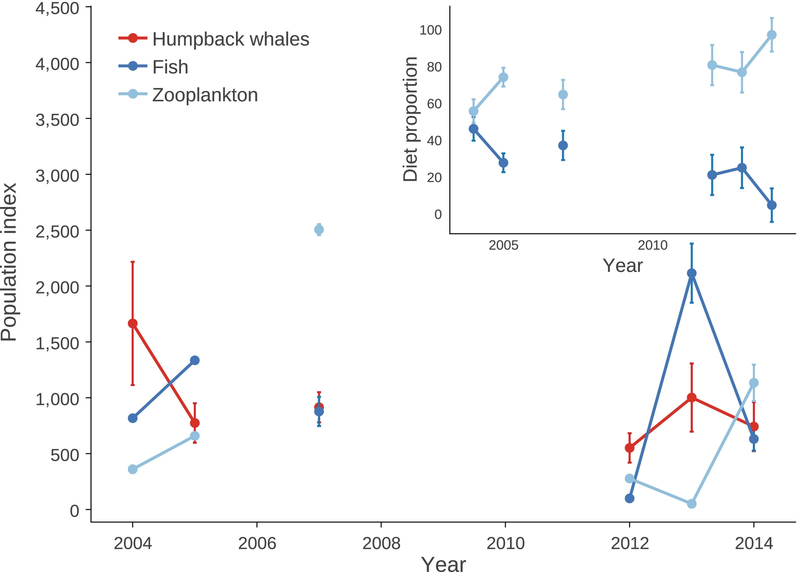

# Using publicly available data

#### 1. Go to [Dryad](https://datadryad.org/search) to choose a published paper and data set and reconstruct your own figure. Code a `ggplot` graph that looks as close to the published figure as you can.
I got my data from this study on [integrating abundance and diet data to improve inferences of food web dynamics](https://besjournals.onlinelibrary.wiley.com/doi/10.1111/2041-210X.13001).

This is the image I based my graph off of:


And this is my graph:


```{r echo=FALSE, results='hide',message=FALSE, fig.width=10,fig.height=7}
library(tidyverse)
library(dplyr)
library(scales)

RawData <- read.table("data/AbundanceDiet_data.csv", header=TRUE, sep=",", stringsAsFactors = TRUE)

Fig1Data <- select(RawData, 1, 2, 4, 6) %>%
  rename("Humpback_whales" = "Humpback.abundance",
         "Fish" = "Fish.population.index", 
         "Zooplankton" = "Zooplankton.population.index")

Fig1a <- Fig1Data %>%
  select(Year, Humpback_whales, Fish, Zooplankton) %>%
  gather(key = "species", value = "abundance", -Year)

Fig1 <- ggplot(Fig1a, aes(x = Year, y = abundance)) + 
  geom_point(aes(color = species)) + 
  geom_line(aes(color = species)) +
  scale_color_manual(values = c("royalblue1", "red2", "lightblue3")) + 
  xlab("Year") + #labels x-axis
  ylab("Population Index") + # labels y-axis
  theme_classic() + # matches theme
  scale_y_continuous(label=comma, limits = c(min(0), max(4500)), breaks = seq(0, 4500, by= 500)) + # adds commas, breaks, and limits  to y-axis
  theme(legend.position = c(.03, .9), 
        legend.justification='left',
        legend.title= element_blank(),
        legend.text = element_text(size = 17),
        axis.title = element_text(size = 17),
        axis.text = element_text(size =17)) +
  guides(color=guide_legend(nrow=3, byrow=TRUE)) +
  scale_fill_discrete(breaks=c('Humpback_Whales', 'Fish', 'Zooplankton'))


Fig2Data <- select(RawData, 9, 14, 15) %>%
  rename("Year"="Year.1", 
         "Fish" = "X50.00.",
         "Zooplankton" = "X97.50.")

Fig2a <- Fig2Data %>%
  select(Year, Fish, Zooplankton) %>%
  gather(key = "species", value = "abundance", -Year)

Fig2 <- ggplot(Fig2a, aes(x = Year, y = abundance)) +
  geom_point(aes(color = species)) + 
  geom_line(aes(color = species)) +
  scale_color_manual(values = c("royalblue1", "lightblue3")) +
  xlab("Year") + #labels x-axis
  ylab("Diet proportion") + # labels y-axis
  theme_classic() +
  scale_y_continuous(limits = c(min(0), max(100)), breaks = seq(0, 100, by= 20)) +
  scale_x_continuous(breaks = seq(2005, 2010, by= 5)) +
  theme(legend.position = "none",
        axis.title = element_text(size = 17),
        axis.text = element_text(size =17))

library(patchwork)

Fig1 + annotation_custom(ggplotGrob(Fig2), xmin = 2009, xmax = 2014, 
                       ymin = 2210, ymax = 4500)
```

#### Here is the chunk of r code that I used to get my graph:
```{r}
library(tidyverse)
library(dplyr)
library(scales)

RawData <- read.table("data/AbundanceDiet_data.csv", header=TRUE, sep=",", stringsAsFactors = TRUE)

Fig1Data <- select(RawData, 1, 2, 4, 6) %>%
  rename("Humpback_whales" = "Humpback.abundance",
         "Fish" = "Fish.population.index", 
         "Zooplankton" = "Zooplankton.population.index")

Fig1a <- Fig1Data %>%
  select(Year, Humpback_whales, Fish, Zooplankton) %>%
  gather(key = "species", value = "abundance", -Year)

Fig1 <- ggplot(Fig1a, aes(x = Year, y = abundance)) + 
  geom_point(aes(color = species)) + 
  geom_line(aes(color = species)) +
  scale_color_manual(values = c("royalblue1", "red2", "lightblue3")) + 
  xlab("Year") + #labels x-axis
  ylab("Population Index") + # labels y-axis
  theme_classic() + # matches theme
  scale_y_continuous(label=comma, limits = c(min(0), max(4500)), breaks = seq(0, 4500, by= 500)) + # adds commas, breaks, and limits  to y-axis
  theme(legend.position = c(.03, .9), 
        legend.justification='left',
        legend.title= element_blank(),
        axis.title = element_text(size = 14)) +
  guides(color=guide_legend(nrow=3, byrow=TRUE)) +
  scale_fill_discrete(breaks=c('Humpback_Whales', 'Fish', 'Zooplankton'))

Fig1


Fig2Data <- select(RawData, 9, 14, 15) %>%
  rename("Year"="Year.1", 
         "Fish" = "X50.00.",
         "Zooplankton" = "X97.50.")

Fig2a <- Fig2Data %>%
  select(Year, Fish, Zooplankton) %>%
  gather(key = "species", value = "abundance", -Year)

Fig2 <- ggplot(Fig2a, aes(x = Year, y = abundance)) +
  geom_point(aes(color = species)) + 
  geom_line(aes(color = species)) +
  scale_color_manual(values = c("royalblue1", "lightblue3")) +
  xlab("Year") + #labels x-axis
  ylab("Diet proportion") + # labels y-axis
  theme_classic() +
  scale_y_continuous(limits = c(min(0), max(100)), breaks = seq(0, 100, by= 20)) +
  scale_x_continuous(breaks = seq(2005, 2010, by= 5)) +
  theme(legend.position = "none",
        axis.title = element_text(size = 14))


Fig2

library(patchwork)

Fig1 + annotation_custom(ggplotGrob(Fig2), xmin = 2009, xmax = 2014, 
                       ymin = 2210, ymax = 4500)
```
